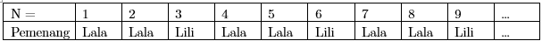
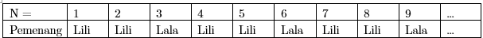

# LSM

Untuk menyelesaikan soal ini, kita dapat melakukan uji coba berbagai kasus kemudian melakukan observasi terhadap ketergantungan hasil kemenangan berdasarkan nilai *N.*

*Kasus 1 : Lala Bermain Duluan*

Lakukan simulasi optimal permainan

Untuk N  = 1 , sudah pasti Lala pemenangnya

Untuk N = 2, Lala mengambil semua bola sehingga ia langsung menang setelahnya

Untuk N = 3, Lala mengambil 2 bola, kemudian Lili mengambil 1 bola sehingga Lili menang

Untuk N = 4, Lala mengambil 1 bola, Lili mengambil 2 bola, kemudian Lala mengambil 1 bola dan Lala menang. Kemungkinan lain adalah Lala mengambil 1 bola, Lili mengambil 1 bola, lalu Lala mengambil 1 bola tersisa dan kemudian ia menang.

Untuk N = 6, bagi kasus

-   Lala mengambil 1 bola,
Lili dapat bermain optimal dengan mengambil 5 bola sehingga Lili menang

Lili dapat bermain optimal dengan mengambil 2 bola, kemudian Lala mengambil 2 bola, dan di akhir Lili mengambil 1 bola sehingga Lili menang-   Lala mengambil 2 bola,
Lili dapat bermain optimal dengan mengambil 1 bola, 2 bola lagi diambil Lala , dan 1 bola terakhir diambil Lili, sehingga Lili menang.-   Lala mengambil 5 bola,
Lili dapat bermain optimal dengan mengambil 1 bola terakhir sehingga ia menang

Dapat dilihat untuk N = 6 , bagaimanapun langkah awal Lala, Lili dapat bermain secara optimal dan menang. Lakukan langkah yang sama untuk N = 7, N = 8, dst …

Akan ditemukan pola sebagai berikut.

*Kasus 2 : Lili Bermain Duluan*

Dari observasi yang serupa dengan sebelumnya kita tinggal merubah saja Lili sebagai pemain pertama dan Lala sebagai pemain kedua.

Akan ditemukan pola sebagai berikut.

Sehingga dapat ditemukan
solusi dari soal ini :- Untuk C = 1 (Lala bermain duluan)

Terlihat bahwa untuk N kelipatan 3 pemenangnya pasti Lili, selain itu pemenangnya adalah Lala.

- Untuk C = 2 (Lili bermain duluan)

Terlihat bahwa untuk N kelipatan 3 pemenangnya pasti Lala, selain itu pemenangnya adalah
Lili.
