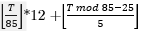
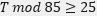
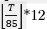

# MA

Pertama kita hitung dalam satu kali lalu lintas dapat ditentukan lampu merah selama 20 bdetik, kuning 5 detik, dan lampu hijau selama 60 detik. Setiap 5 detik lampu hijau 1 mobil keluar. Ini artinya selama lampu hijau menyala ada 12 mobil yang jalan (/60 detik).

Diperoleh bahwa dalam satu kali lalu lintaselama 20 + 5 + 60 = 85 detik ada 12 mobil yang keluar. Kita dapat menghitung jumlah mobil yang keluar adalah
 untuk  jika tidak maka jumlah mobil yang keluar adalah hanya  saja. Mobil kita dapat jalan jika dan hanya jika jumlah mobil yang keluar lebih dari sama dengan M + 1 dan akan menyisakan (M + N + 1 – jumlah mobil yang keluar) mobil di perhentian lampu merah.
